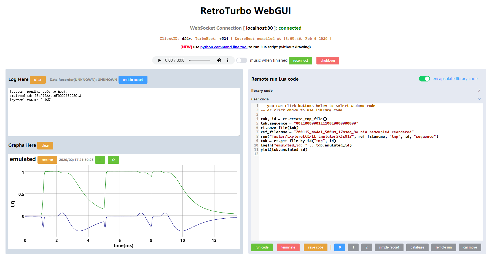
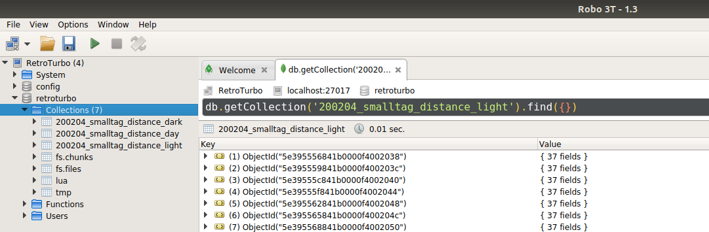
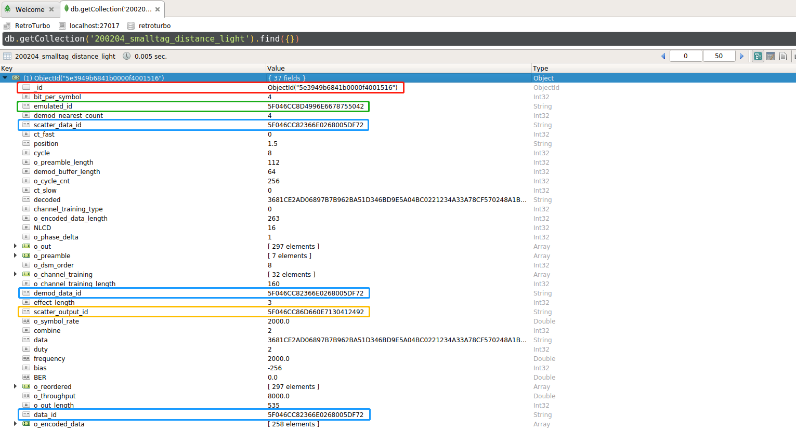
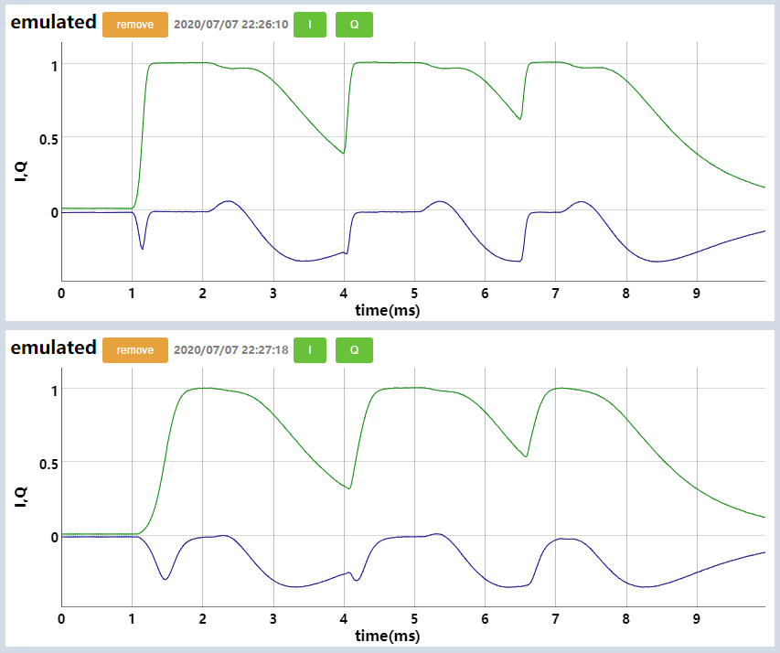

# RetroTurboAE
Artifact evaluation of RetroTurbo

## Overview

We developed a GUI testing framework that connects RetroTurbo hardware (reader and tag) as well as providing data handling and visualization tools. To use this framework, one should run the following command

```shell
cd ~/RetroTurboAE/build
./Tester/TurboHost/TH_Host
```

Then you can open the browser and visit [http://localhost/retroturbo/]() for GUI, as shown below:



It mainly contains three parts, namely script block, log block and data visualization block. You can type your Lua code in the script block on the right side, then click the green button `run code` to execute them. We save our experiment scripts in `WebGUI/lua` folder if you're interested in how they interacts with real hardware and assist with our experiments.

In this artifact evaluation, we only demonstrate software things about modulation and demodulation process. The raw data of our experiments is recorded in Mongo database and you can visit it with Robo 3T for more cases to try out.

## 1. Modulation

The modulation scheme outputs a compressed vector for tag to send at a fixed sample rate. You can run the following code in script block.

```lua
collection = "tmp"  -- use a temporary table for test
-- first create document contain the parameters
id = mongo_create_one_with_jsonstr(collection, "{}")
local tab = rt.get_file_by_id(collection, id)
tab.NLCD = 8
tab.combine = 1  -- DSM order = NLCD/combine = 8
tab.frequency = {} tab.frequency["$numberDouble"] = "2000"  -- 2kS/s sample rate
tab.cycle = 8  -- DSM symbol duration, 8/2000 = 4ms
tab.duty = 2  -- charging phase duration, 2/2000 = 1ms
tab.bit_per_symbol = 4  -- PQAM order, 2^4 = 16
tab.data = generate_random_data(16)
logln("send random data: " .. tab.data)
tab.channel_training_type = 0  -- use offline and online channel training
tab.ct_fast = 0  -- not used with channel_training_type = 0
tab.ct_slow = 0  -- not used with channel_training_type = 0
rt.save_file(tab)
-- then run program to modulate data
run("Tester/HandleData/HD_FastDSM_Modulate", collection, id)
tab = rt.get_file_by_id(collection, id)
for i=1,#tab.o_out do
    logln(tab.o_out[i])
end
```

Run the script, and it will print out something like

```ini
[system] sending code to host...
send random data: 676B0BD314254BE5CDF65A75EB499DC7
<< preamble start >>
0000000000000000:8
0F0F0F0F0F0F0F0F:8
FFFFFFFFFFFFFFFF:8
F0F0F0F0F0F0F0F0:24
0F0F0F0F0F0F0F0F:24
FFFFFFFFFFFFFFFF:16
0000000000000000:24
<< channel training start >>
FFFF0FF00F0F0000:2
0000000000000000:6
··········································  more channel training
0000000000000000:38
<< data start >>
00000000000000A5:1
000000000000AFA5:1
0000000000F5AF00:1
00000000AFF50000:1
000000F5AF000000:1
000000F500000000:1
0005000000000000:1
5A05000000000000:1
5A000000000000A0:1
0000000000000AA0:1
··········································  more data
0000000000000000:6
[system] return 0 (OK)
```

The hex value shows the PQAM symbol that each LCM module should send, and you can see a step-like shape of the non-zero values in the data part because of the DSM arrangement.

## 2. Demodulation

The raw data of real-world experiments is recorded in three collections named `day`, `light` and `dark` in  Mongo database. You can open Robo 3T by running `robot3t` and click `RetroTurbo` database connection to view them:



The three collections `200204_smalltag_distance_dark`, `200204_smalltag_distance_day` and `200204_smalltag_distance_light` are real-world experiment data with the same format. Each document contains the following json:



The red one is document id which could be used with collection name to identify a specific document. The blue one is origin data id, which stores the received waveform at 80kS/s. The yellow one is the emulated id, which stores the emulated waveform given the correct data and channel training output. The green one is scatter plot that illustrates the noise level. To visualize those waveforms and scatter plot, you can run the following code in RetroTurbo GUI.

```lua
plot("5F046CC82366E0268005DF72")  -- data_id, also demod_data_id and scatter_data_id
plot("5F046CC8D4996E6678755042")  -- emulated_id
plot("5F046CC86D660E7130412492")  -- scatter_output_id
```

Click `run code` and the figures will show in the left side


Till now we only display the existing data, including the original waveform and computed waveforms. We would then run the demodulation program to regenerate those results. Run the following Lua code to demodulate a specific packet, where you can pick up the collection name and document id mentioned above.

```lua
collection = "200204_smalltag_distance_light"
id = "5e3949b6841b0000f4001516"  -- document id
rpc_port = 52220  -- channel training daemon starts at 52220 port when boot up

tab = rt.get_file_by_id(collection, id)
tab.demod_buffer_length = 64  -- demodulation branch size K in paper Sec.4.3.2
tab.demod_nearest_count = 4  -- limit PQAM symbol decision count (optimization)
-- remove those computed attributes to make sure it's computed again
tab.scatter_output_id = nil
tab.BER = nil
tab.emulated_id = nil
rt.save_file(tab)

-- run scatter plot
run("Tester/Emulation/EM_ScatterPlot", collection, id, ""..rpc_port)
tab = rt.get_file_by_id(collection, id)
plot(tab.scatter_output_id)

-- run demodulate
run("Tester/Emulation/EM_Demodulate", collection, id, ""..rpc_port)
tab = rt.get_file_by_id(collection, id)
BER = tonumber(tab.BER["$numberDouble"])
logln("BER: " .. (BER * 100) .. "%")

-- run emulate using reference with channel training
run("Tester/Emulation/EM_EmulateCtd", collection, id, ""..rpc_port)
tab = rt.get_file_by_id(collection, id)
plot(tab.emulated_id)
```

For further details please see the source files, located in `Tester/Emulation/Demodulate.cpp`

## 3. Emulation

In Sec.5.2 we introduced an approximation technique that could emulate the response of LCM. You can emulate any waveform at 2kS/s (2000 symbols per second), by running

```shell
./Tester/ExploreLCD/EL_200121_Emulator 17mseq_9v.bin   00110000110001000000
./Tester/ExploreLCD/EL_200121_Emulator 17mseq_5.5v.bin 00110000110001000000
```

It will send the symbols (1 for charge and 0 for discharge) with different driven voltage of 9V and 5.5V. You can plot the result in GUI, like below:



It shows that 9V driven voltage has faster charging speed and almost the same discharging speed compared to 5.5V driven voltage.

## Environment Setup

Although the virtual machine has everything setup, you might be interested in deploy them elsewhere. In this section we will introduce how to install it on Windows or Linux.

You need to install `libmosquitto` (must with websockets enabled, you need to enable it in `config.mk` before compile it in source code) and `libmongoc` (together with `libbson`). The frontend use `mosquitto` to communicate with backend in real time. Also, you need common build tools like `cmake`, `g++`, etc. You would also need to install `nginx` to use the GUI testing framework.

To build the project, move to the root of this repo then run

```shell
cd build
cmake ..  # if you're using Linux
cmake .. -G "MinGW Makefiles"  # if you're using windows with mingw64
make -j8  # compile
```

It should all succeed, then you would be able to run those programs but still need some configurations towards the testing framework of RetroTurbo.

1. configure the `mosquitto` MQTT server. edit the configuration file (in Ubuntu system that is `/etc/mosquitto/mosquitto.conf`, similar for Windows) and add the following to it

   - ```ini
     port 1883
     protocol mqtt
     listener 9000
     protocol websockets
     ```

2. configure the nginx web server (`/etc/nginx/sites-enabled/default` in Ubuntu, `bin/`).

   - ```ini
     # this is to server your file
     location ~ ^\/retroturbo(.*)$ {
     	root /home/yue/RetroTurbo/WebGUI;  # change this to your location
     	try_files $1 $1index.html = 404;
     }
     # this is to proxy your mqtt websocket connection
     location ~ ^\/mqtt$ {
     	proxy_pass http://127.0.0.1:9000;
     	proxy_http_version 1.1;
     	proxy_set_header Upgrade $http_upgrade;
     	proxy_set_header Connection "upgrade";
     }
     ```

After all this, you can run `build/Tester/TurboHost/TH_Host.exe` to start the backend, as mentioned in overview.

To assist demodulation program, you would also need to start a channel training daemon that would takes a binary reference file and several arguments as input. You can simple run the following command

```shell
cd build
./Tester/MatLab/ML_ctd 52220 ./refs8x2_8000_8_2002041406.bin 16 320 3 4 16
```

It will start a RPC service at 52220 port, then you would use it to start demodulation programs as mentioned above.